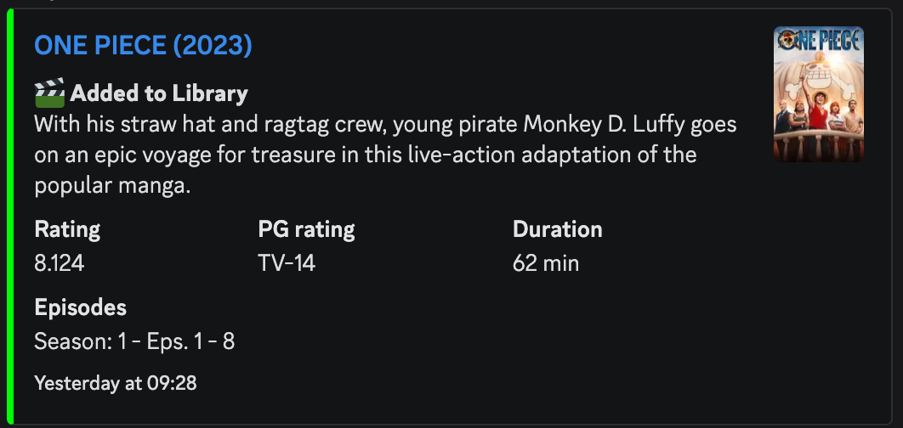
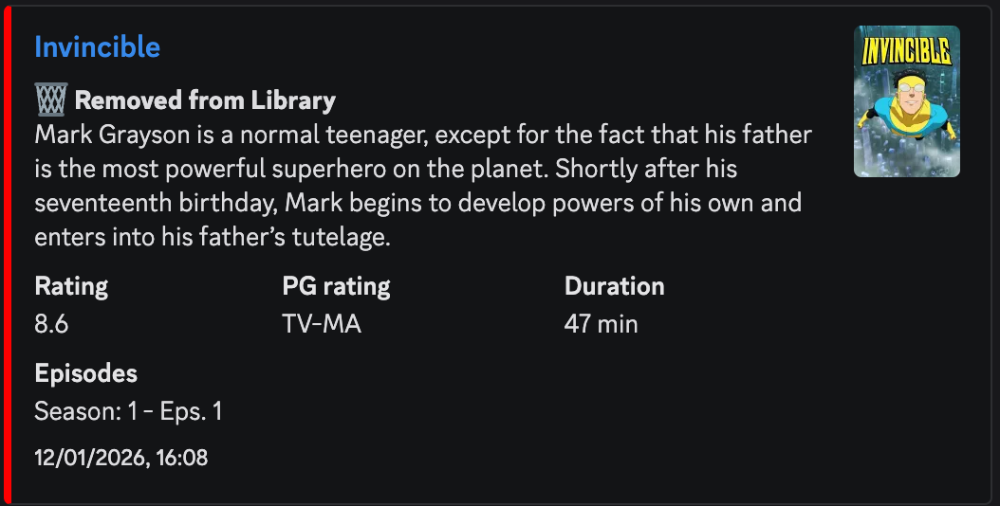
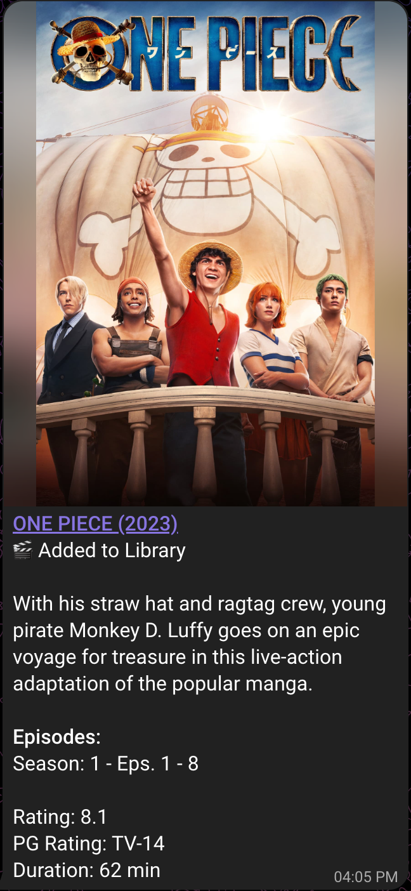
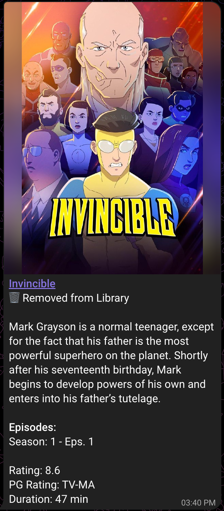

# Jellyfin Newsletter Plugin

<p align='center'>
    <br>
</p>

This repository is a maintained fork of the [Jellyfin Newsletter Plugin](https://github.com/Cloud9Developer/Jellyfin-Newsletter-Plugin), originally created by [Cloud9Developer](https://github.com/Cloud9Developer). As the original repository is no longer actively maintained, this introduces several improvements, new features, and bug fixes, including:

* Discord Webhook Support
* Telegram Support
* Removal of Imgur and Local Hosted Image Dependencies
* TMDB Integration
* Local Poster images support as attachments
* Event-Based item detection and notifications (Add/Update/Delete)
* Per-library selection for series and movies
* Multiple Bug Fixes, Enhancements and much more!!!

# Description

This plugin uses event-driven notifications with scheduled processing. When library changes occur (additions, or deletions), they are detected in real-time and stored in the database. A hidden background task processes these events every 30 seconds, and the main Newsletter task generates and sends newsletters containing all accumulated events.

<h2 align="center">Email Screenshots</h2>
<p align="center">
    
    
</p>

<h2 align="center">Discord Screenshots</h2>
<p align="center">
    
    
</p>

<h2 align="center">Telegram Screenshots</h2>
<p align="center">
    
    
</p>

# File Structure

To ensure proper images are being pulled from Jellyfin's database, ensure you follow the standard Organization Scheme for naming and organizing your files. https://jellyfin.org/docs/general/server/media/books

If this format isn't followed properly, Jellyfin may have issue correctly saving the item's data in the proper database (the database that this plugin uses).

```
Shows
├── Series (2010)
│   ├── Season 00
│   │   ├── Some Special.mkv
│   │   ├── Episode S00E01.mkv
│   │   └── Episode S00E02.mkv
│   ├── Season 01
│   │   ├── Episode S01E01-E02.mkv
│   │   ├── Episode S01E03.mkv
│   │   └── Episode S01E04.mkv
│   └── Season 02
│       ├── Episode S02E01.mkv
│       ├── Episode S02E02.mkv
│       ├── Episode S02E03 Part 1.mkv
│       └── Episode S02E03 Part 2.mkv
└── Series (2018)
    ├── Episode S01E01.mkv
    ├── Episode S01E02.mkv
    ├── Episode S02E01-E02.mkv
    └── Episode S02E03.mkv

Movies
├── Film (1990).mp4
├── Film (1994).mp4
├── Film (2008)
│   └── Film.mkv
└── Film (2010)
    ├── Film-cd1.avi
    └── Film-cd2.avi
```

# How It Works

This plugin uses event-driven notifications with scheduled processing. When library changes occur:

- Library events (add/delete) are detected in real-time and stored in the database
- A hidden background task processes these events every 30 seconds
- The main Newsletter task generates and sends newsletters containing all accumulated events

# Testing/Run Frequency

Testing and Frequency can be managed through your Dashboard > Scheduled Tasks

- There are 2 scheduled tasks:
  - Newsletter: Generates and sends out newsletters containing all accumulated events since the last newsletter was sent
  - Newsletter Item Scraper (***hidden***): Processes library events stored in the database (runs every 30 seconds)

# Installation

Manifest is up and running! You can now import the manifest in Jellyfin and this plugin will appear in the Catalog!

- Go to "Plugins" on your "Dashboard"
- Go to the "Manage Repositories" tab
- Click the '+ New Respository' to add a new Repository
  - Give it a name (for eg. Newsletters)
  - In "Repository URL," put "https://raw.githubusercontent.com/Sanidhya30/Jellyfin-Newsletter/master/manifest.json"
  - Click "Save"
- You should now see Jellyfin Newsletters in Catalog under the Category "Newsletters"
- Once installed, restart Jellyfin to activate the plugin and configure your settings for the plugin

# Configuration

## General Config

### Server URL

- The server url of your jellyfin. This will be used for direct link in discord webhook.

### Library Selection

- Choose specific libraries within each item type(Movies/Series) to include in newsletters
  - Allows fine-grained control over which libraries trigger notifications

### Newsletter Event Settings

Configure which library events should be the part of newsletters:

#### Send newsletter when items are added

- Enable newly added items section in the newsletter (default: enabled).

#### Send newsletter when items are updated

- Enable updated items section in the newsletter. Updates are detected when media files are upgraded (e.g., by tools like Radarr/Sonarr), where the old file is deleted and a new one is added with the same title/season/episode information (default: disabled).

#### Send newsletter when items are deleted

- Enable deleted items section in the newsletter (default: enabled).

### Community Rating Decimal Places

- Configure the number of decimal places to display for community ratings in newsletters (0-4 places, default: 1)

## Newsletter HTML Format

Allows for use of custom HTML formatting for emails! Defaults to original formatting, but can be modified now!

For defaults, see `Jellyfin.Plugin.Newsletters/Templates/`

### Body HTML

- The main body of your email

### EntryData HTML

- The formatting for each individual entry/series/movie that was found and will be sent out

## Scrapper Config

### Poster Type

* TMDB Poster - Uses image URLs from TheMovieDB (default, smallest emails).
* Local Poster Images - Embeds local poster images directly in the email/discord embed (larger messages).
  * Maximum Email Size: Maximum email size allowed by your email provider (in MB). **Default: 15 MB.**

## Email & SMTP Config

### To Addresses:

- Recipients of the newsletter. Add as many emails as you'd like, separated by commas.
  - All emails will be sent out via BCC

### From Address

- The address recipients will see on emails as the sender
  - Defaults to JellyfinNewsletter@donotreply.com

### Subject

- The subject of the email

### Smtp Server Address

- The email server address you want to use.
  - Defaults to smtp.gmail.com

### Smtp Port

- The port number used by the email server above
  - Defaults to gmail's port (587)

### Smtp Username

- Your username/email to authenticate to the SMTP server above

### Smtp Password

- Your password to authenticate to the SMTP server above
  - I'm not sure about other email servers, but Google requires a Dev password to be created.
    - For gmail specific instructions, you can visit https://support.google.com/mail/answer/185833?hl=en for details

## Discord Config

### Webhook URL:

- Your discord webhook url

### Webhook Name

- Name for your discord webhook, defaults to "Jellyfin Newsletter"

### Fields & Color selection

- Select the fields that you want as part of your embed.
- Select the embed color for each event type (Add, Update, Delete) and item type (Series, Movies).

## Telegram Config

### Bot Token:

- Your Telegram bot token obtained from BotFather

### Chat ID:

- The chat ID(can be a user ID, group ID, or channel ID) where you want to send the newsletters

### Fields selection

- Select the fields that you want as part of your message.

# Issues

Please leave a ticket in the Issues on this GitHub page and I will get to it as soon as I can.
Please be patient with me, since I did this on the side of my normal job. But I will try to fix any issues that come up to the best of my ability and as fast as I can!

# Available HTML Data Tags

Some of these may not interest that average user (if anyone), but I figured I would have any element in the Newsletters.db be available for use! `<br>`
**NOTE:** *Examples of most tags can be found in the default Templates (template_modern_body.html AND template_modern_entry.html)*

## Required Tags

```
- {EntryData} - Needs to be inside of the 'Body' html
```

## Recommended Tags

```
- {Date} - Auto-generated date of Newsletter email generation
- {SeasonEpsInfo} - This tag is the Plugin-generated Season/Episode data
- {Title} - Title of Movie/Series
- {SeriesOverview} - Movie/Series overview
- {ImageURL} - Poster image for the Movie/Series
- {ItemURL} - Direct link to the item in Jellyfin's web interface
- {Type} - Item type (Movie or Series)
- {PremiereYear} - Year Movie/Series was Premiered
- {RunTime} - Movie/Episode Duration (for Series, gives first found duration. Will fix for only single episode or average in future update)
- {OfficialRating} - TV-PG, TV-13, TV-14, etc.
- {CommunityRating} - Numerical rating stored in Jellyfin's metadata
- {EventBadge} - Visual badge indicating the event type (NEW, UPDATED, REMOVED)
```

## Non-Recommended Tags

These tags are ***available*** but not recommended to use. Untested behavior using these.

```
- {Filename} - File path of the Movie/Episode (NOT RECOMMENDED TO USE)
- {Season} - Season number of Episode (NOT RECOMMENDED TO USE)
- {Episode} - Episode number (NOT RECOMMENDED TO USE)
- {ItemID} - Jellyfin's assigned ItemID (NOT RECOMMENDED TO USE)
- {PosterPath} - Jellyfin's assigned Poster Path (NOT RECOMMENDED TO USE)
```

## Known Issues

See 'issues' tab in GitHub with the label 'bug'

# Planned Features

The following features are planned for future releases:

- [ ] **Support for delete events for series/season**
  - Enhanced deletion tracking for series and individual seasons
  - Improved cleanup of related data

- [ ] **Support for update events to update the database**
  - Real-time database synchronization for item updates
  - Better handling of metadata changes and file upgrades

- [ ] **Support for music/audio items**
  - Extend newsletter functionality to music libraries
  - Include album art, artist information, and track details

- [ ] **Multiple webhook/telegram ID/email support with configurable parameters**
  - Support for multiple notification endpoints per event type
  - Individual configuration options for each recipient/channel
  - Granular control over which events trigger newsletter for each endpoint

- [ ] **Upcoming series/episodes section for newsletter**
  - Integration with TV show databases for release date tracking
  - Configurable lead time for upcoming content newsletter

# Contribute

If you would like to collaborate/contribute, feel free! Make all PR's to the 'development' branch and please note clearly what was added/fixed, thanks!
