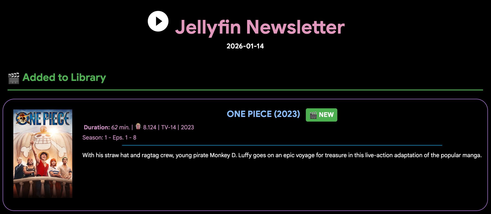
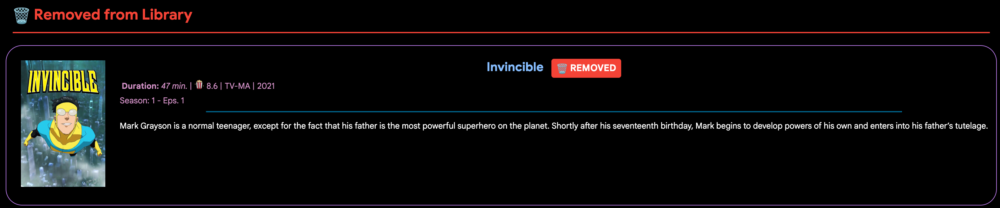
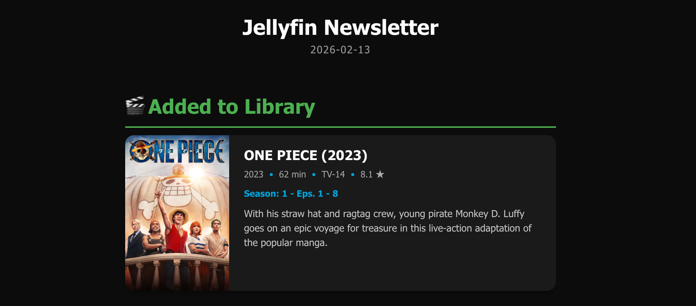
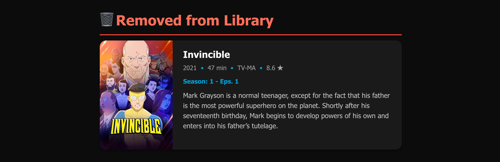
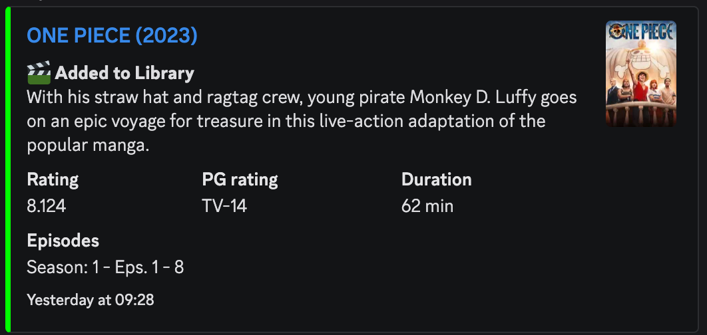
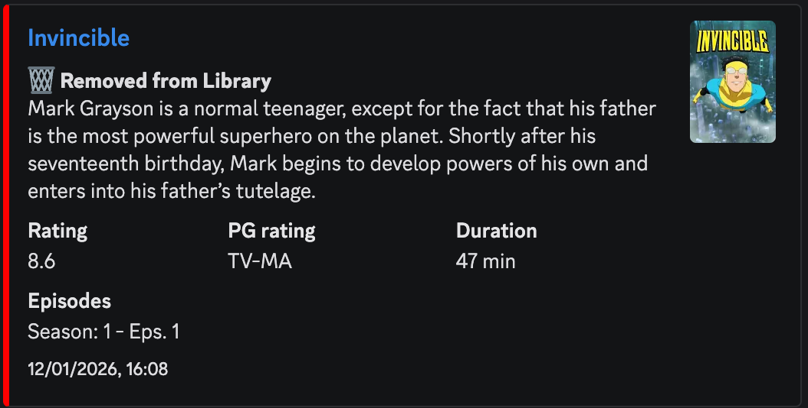
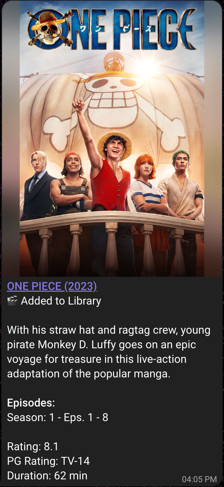
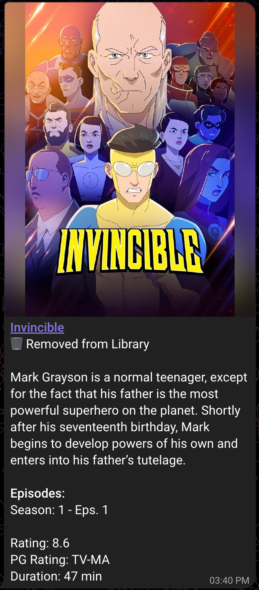
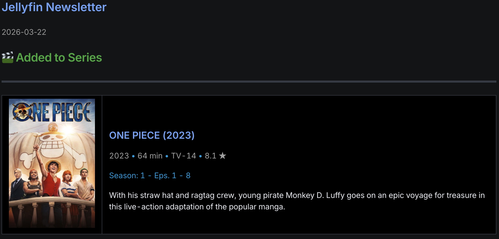
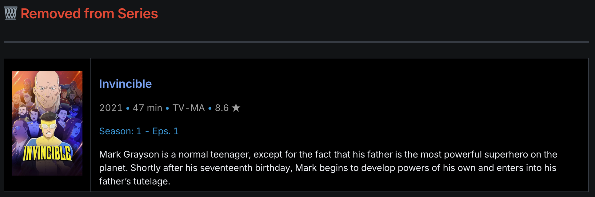

# Jellyfin Newsletter Plugin

<p align='center'>
    <br>
</p>

This repository is a maintained fork of the [Jellyfin Newsletter Plugin](https://github.com/Cloud9Developer/Jellyfin-Newsletter-Plugin), originally created by [Cloud9Developer](https://github.com/Cloud9Developer). As the original repository is no longer actively maintained, this introduces several improvements, new features, and bug fixes, including:

* Discord Webhook Support
* Telegram Support
* Matrix Support
* Multiple Client Instances (Discord, Telegram, Matrix, Email)
* Multiple Email Templates (Modern/Classic)
* Removal of Imgur and Local Hosted Image Dependencies
* TMDB Integration
* Local Poster images support as attachments
* Event-Based item detection and notifications (Add/Update/Delete)
* Per-library selection for series and movies per client
* Radarr & Sonarr Integration for Upcoming Media
* Multiple Bug Fixes, Enhancements and much more!!!

# Description

This plugin uses event-driven notifications with scheduled processing. When library changes occur (additions or deletions), they are detected in real-time and stored in the database. A hidden background task processes these events every 30 seconds, and the main Newsletter task generates and sends newsletters containing all accumulated events.

Additionally, the plugin integrates with **Radarr** and **Sonarr** to include upcoming media in your newsletters, giving users a preview of what's coming soon to your server.

# Screenshots

<details>
<summary><big>Email Screenshots</big></summary>

### Classic Template

<p align="center">
    
    
</p>

### Modern Template

<p align="center">
    
    
</p>

</details>

<details>
<summary><big>Discord Screenshots</big></summary>

<p align="center">
    
    
</p>

</details>

<details>
<summary><big>Telegram Screenshots</big></summary>

<p align="center">
    
    
</p>

</details>

<details>
<summary><big>Matrix Screenshots (Element Client)</big></summary>

> Screenshots captured using the [Element](https://element.io/) Matrix client.

<p align="center">
    
    
</p>

</details>

# File Structure

To ensure proper images are being pulled from Jellyfin's database, ensure you follow the standard Organization Scheme for naming and organizing your files. https://jellyfin.org/docs/general/server/media/books

If this format isn't followed properly, Jellyfin may have issue correctly saving the item's data in the proper database (the database that this plugin uses).

```
Shows
├── Series (2010)
│   ├── Season 00
│   │   ├── Some Special.mkv
│   │   ├── Episode S00E01.mkv
│   │   └── Episode S00E02.mkv
│   ├── Season 01
│   │   ├── Episode S01E01-E02.mkv
│   │   ├── Episode S01E03.mkv
│   │   └── Episode S01E04.mkv
│   └── Season 02
│       ├── Episode S02E01.mkv
│       ├── Episode S02E02.mkv
│       ├── Episode S02E03 Part 1.mkv
│       └── Episode S02E03 Part 2.mkv
└── Series (2018)
    ├── Episode S01E01.mkv
    ├── Episode S01E02.mkv
    ├── Episode S02E01-E02.mkv
    └── Episode S02E03.mkv

Movies
├── Film (1990).mp4
├── Film (1994).mp4
├── Film (2008)
│   └── Film.mkv
└── Film (2010)
    ├── Film-cd1.avi
    └── Film-cd2.avi
```

# How It Works

This plugin uses event-driven notifications with scheduled processing. When library changes occur:

- Library events (add/delete) are detected in real-time and stored in the database
- A hidden background task processes these events every 30 seconds
- The main Newsletter task generates and sends newsletters containing all accumulated events

# Testing/Run Frequency

Testing and Frequency can be managed through your Dashboard > Scheduled Tasks

- There are 2 scheduled tasks:
  - Newsletter: Generates and sends out newsletters containing all accumulated events since the last newsletter was sent
  - Newsletter Item Scraper (***hidden***): Processes library events stored in the database (runs every 30 seconds)

# Installation

Manifest is up and running! You can now import the manifest in Jellyfin and this plugin will appear in the Catalog!

- Go to "Plugins" on your "Dashboard"
- Go to the "Manage Repositories" tab
- Click the '+ New Respository' to add a new Repository
  - Give it a name (for eg. Newsletters)
  - In "Repository URL," put "https://raw.githubusercontent.com/Sanidhya30/Jellyfin-Newsletter/master/manifest.json"
  - Click "Save"
- You should now see Jellyfin Newsletters in Catalog under the Category "Newsletters"
- Once installed, restart Jellyfin to activate the plugin and configure your settings for the plugin

# Configuration

<details>
<summary>General Configuration</summary>

### Server URL

- The server url of your jellyfin. This will be used for direct link in discord webhook.

### Community Rating Decimal Places

- Configure the number of decimal places to display for community ratings in newsletters (0-4 places, default: 1)

### Poster Type

* TMDB Poster - Uses image URLs from TheMovieDB (default, smallest emails).
* Local Poster Images - Embeds local poster images directly in the email/discord embed (larger messages).

### Radarr / Sonarr Configuration

> ***You can configure multiple Radarr and Sonarr instances. Each instance has its own URL, API key, and instance name. The plugin uses these to fetch upcoming media via the Radarr/Sonarr calendar APIs.***

### Instance Name

- A name for this Radarr/Sonarr instance. This name appears as the section header in the upcoming media portion of your newsletter.

### URL

- The base URL of your Radarr/Sonarr instance (e.g., `http://localhost:7878` for Radarr, `http://localhost:8989` for Sonarr).

### API Key

- The API key for your Radarr/Sonarr instance. Found under Settings → General → API Key in the respective application.

### Test Connection

- Use the "Test" button to verify connectivity to your Radarr/Sonarr instance before saving.

### Upcoming Days Ahead

- Configure how many days ahead to look for upcoming content (default: 7 days). This is a global setting shared across all Radarr/Sonarr instances.

</details>

<details>
<summary>Email Configuration</summary>

> ***You can configure Multiple Email Clients. Each client instance has its own SMTP settings, recipients, library selection, event triggers, and template settings.***

### To Addresses:

- Recipients of the newsletter. Add as many emails as you'd like, separated by commas.
  - All emails will be sent out via BCC

### From Address

- The address recipients will see on emails as the sender
  - Defaults to JellyfinNewsletter@donotreply.com

### Subject

- The subject of the email

### Smtp Server Address

- The email server address you want to use.
  - Defaults to smtp.gmail.com

### Smtp Port

- The port number used by the email server above
  - Defaults to gmail's port (587)

### Enable SSL

- Toggle SSL/TLS encryption for the SMTP connection (default: enabled). Disable this if your SMTP server does not support or require SSL.

### Smtp Username

- Your username/email to authenticate to the SMTP server above

### Smtp Password

- Your password to authenticate to the SMTP server above
  - I'm not sure about other email servers, but Google requires a Dev password to be created.
    - For gmail specific instructions, you can visit https://support.google.com/mail/answer/185833?hl=en for details

### Library Selection

- Choose specific libraries within each item type (Movies/Series) to include in newsletters for this email client.

### Newsletter Event Settings

- Configure which library events (Add/Update/Delete/Upcoming) should trigger the newsletters for this email client:
  - **Add**: Enable newly added items section in the newsletter (default: enabled).
  - **Update**: Enable updated items section in the newsletter. Updates are detected when media files are upgraded (e.g., by tools like Radarr/Sonarr), where the old file is deleted and a new one is added with the same title/season/episode information (default: disabled).
  - **Delete**: Enable deleted items section in the newsletter (default: enabled).
  - **Upcoming**: Enable upcoming media section in the newsletter, sourced from Radarr/Sonarr (default: disabled).

### Newsletter Template Category

You can select between different email templates:
- **Modern**: A sleek, card-based design. Fully compatible for mobile view.
- **Classic**: A more traditional list-based layout.

### Body HTML

- Define custom HTML structure for the main email body. If left empty, the default HTML from the selected **Newsletter Template Category** will be used.

### EntryData HTML

- Define custom HTML formatting for each individual media item (Movies/Series) in the newsletter. If left empty, the default HTML from the selected **Newsletter Template Category** will be used.

### Header HTML

- Define custom HTML for section headers (e.g., "Added to Movies", "Removed from Series"). The template uses `<template>` tags with IDs to define all four event-type headers in a single file:
  - `<template id="header-add">` - Header for newly added items
  - `<template id="header-update">` - Header for updated items
  - `<template id="header-delete">` - Header for deleted items
  - `<template id="header-upcoming">` - Header for upcoming items
- **Placeholder**: `{LibraryName}` - replaced with the library name (e.g., "Movies", "TV Shows")
- If left empty, the default header template from the selected **Newsletter Template Category** will be used.

</details>

<details>
<summary>Discord Configuration</summary>

> ***You can now configure Multiple Discord Clients. Each client instance can have its own Webhook URL(s), library selection, and event triggers.***

### Webhook URL

- Your discord webhook url. **Supports multiple webhooks**: You can enter multiple webhook URLs separated by commas `,` to send the same notification to multiple channels.

### Webhook Name

- Name for your discord webhook, defaults to "Jellyfin Newsletter"

### Library Selection

- Choose specific libraries within each item type (Movies/Series) to include in newsletters for this Discord client.

### Newsletter Event Settings

- Configure which library events (Add/Update/Delete/Upcoming) should trigger Discord notifications:
  - **Add**: Enable newly added items section in the newsletter (default: enabled).
  - **Update**: Enable updated items section in the newsletter. Updates are detected when media files are upgraded (e.g., by tools like Radarr/Sonarr), where the old file is deleted and a new one is added with the same title/season/episode information (default: disabled).
  - **Delete**: Enable deleted items section in the newsletter (default: enabled).
  - **Upcoming**: Enable upcoming media section in the newsletter, sourced from Radarr/Sonarr (default: disabled).

### Fields & Color selection

- Select the fields that you want as part of your embed.
- Select the embed color for each event type (Add, Update, Delete) and item type (Series, Movies).

</details>

<details>
<summary>Telegram Configuration</summary>

> ***You can now configure Multiple Telegram Clients. Each client instance can have its own Bot Token/Chat IDs, library selection and event configurations.***

### Bot Token:

- Your Telegram bot token obtained from BotFather

### Chat ID:

- The chat ID(can be a user ID, group ID, or channel ID) where you want to send the newsletters. **Supports multiple Chat IDs**: You can enter multiple Chat IDs separated by commas `,`.

### Library Selection

- Choose specific libraries within each item type (Movies/Series) to include in newsletters for this Telegram client.

### Newsletter Event Settings

- Configure which library events (Add/Update/Delete/Upcoming) should trigger Telegram notifications:
  - **Add**: Enable newly added items section in the newsletter (default: enabled).
  - **Update**: Enable updated items section in the newsletter. Updates are detected when media files are upgraded (e.g., by tools like Radarr/Sonarr), where the old file is deleted and a new one is added with the same title/season/episode information (default: disabled).
  - **Delete**: Enable deleted items section in the newsletter (default: enabled).
  - **Upcoming**: Enable upcoming media section in the newsletter, sourced from Radarr/Sonarr (default: disabled).

### Fields selection

- Select the fields that you want as part of your message.
</details>

<details>
<summary>Matrix Configuration</summary>

> ***You can configure Multiple Matrix Clients. Each client instance can have its own Homeserver URL, Access Token, Room ID(s), library selection, and event configurations.***

### Homeserver URL

- The URL of your Matrix homeserver (e.g., `https://matrix.org` or your self-hosted instance URL).

### Access Token

- The access token for your Matrix bot/user account. This is used to authenticate API requests to the homeserver.

### Room ID

- The Room ID where newsletters will be sent (e.g., `!roomid:matrix.org`). You can find this in your Matrix client's room settings. **Supports multiple Room IDs**: You can enter multiple Room IDs separated by commas `,`.

### Test Message

- Use the "Test" button to send a test message and verify your Matrix configuration before saving.

### Library Selection

- Choose specific libraries within each item type (Movies/Series) to include in newsletters for this Matrix client.

### Newsletter Event Settings

- Configure which library events (Add/Update/Delete/Upcoming) should trigger Matrix notifications:
  - **Add**: Enable newly added items section in the newsletter (default: enabled).
  - **Update**: Enable updated items section in the newsletter. Updates are detected when media files are upgraded (e.g., by tools like Radarr/Sonarr), where the old file is deleted and a new one is added with the same title/season/episode information (default: disabled).
  - **Delete**: Enable deleted items section in the newsletter (default: enabled).
  - **Upcoming**: Enable upcoming media section in the newsletter, sourced from Radarr/Sonarr (default: disabled).

### Newsletter Template Category

- Currently, one template is available:
  - **Matrix**: An HTML-based template designed for Matrix clients with HTML rendering support (e.g., Element).

### Body HTML

- Define custom HTML structure for the main message body. If left empty, the default HTML from the selected **Newsletter Template Category** will be used.

### EntryData HTML

- Define custom HTML formatting for each individual media item (Movies/Series) in the newsletter. If left empty, the default HTML from the selected **Newsletter Template Category** will be used.

### Header HTML

- Define custom HTML for section headers (e.g., "Added to Movies", "Removed from Series"). The template uses `<template>` tags with IDs to define all four event-type headers in a single file:
  - `<template id="header-add">` - Header for newly added items
  - `<template id="header-update">` - Header for updated items
  - `<template id="header-delete">` - Header for deleted items
  - `<template id="header-upcoming">` - Header for upcoming items
- **Placeholder**: `{LibraryName}` - replaced with the library name (e.g., "Movies", "TV Shows")
- If left empty, the default header template from the selected **Newsletter Template Category** will be used.

</details>

# Issues

Please leave a ticket in the Issues on this GitHub page and I will get to it as soon as I can.
Please be patient with me, since I did this on the side of my normal job. But I will try to fix any issues that come up to the best of my ability and as fast as I can!

# Available HTML Data Tags

Some of these may not interest that average user (if anyone), but I figured I would have any element in the Newsletters.db be available for use! `<br>`
**NOTE:** *Examples of most tags can be found in the default Templates under `Templates/` (template_body.html, template_entry.html, template_header.html)*

## Required Tags

```
- {EntryData} - Needs to be inside of the 'Body' html
```

## Recommended Tags

```
- {Date} - Auto-generated date of Newsletter email generation
- {ServerURL} - The configured server URL for Jellyfin
- {SeasonEpsInfo} - This tag is the Plugin-generated Season/Episode data
- {Title} - Title of Movie/Series
- {SeriesOverview} - Movie/Series overview
- {ImageURL} - Poster image for the Movie/Series
- {ItemURL} - Direct link to the item in Jellyfin's web interface
- {Type} - Item type (Movie or Series)
- {PremiereYear} - Year Movie/Series was Premiered, in case of upcoming media this is use as the date of release
- {RunTime} - Movie/Episode Duration (for Series, gives first found duration. Will fix for only single episode or average in future update)
- {OfficialRating} - TV-PG, TV-13, TV-14, etc.
- {CommunityRating} - Numerical rating stored in Jellyfin's metadata
- {LibraryName} - The library name (e.g., "Movies", "TV Shows") - used in the Header template
```

## Non-Recommended Tags

These tags are ***available*** but not recommended to use. Untested behavior using these.

```
- {Filename} - File path of the Movie/Episode (NOT RECOMMENDED TO USE)
- {Season} - Season number of Episode (NOT RECOMMENDED TO USE)
- {Episode} - Episode number (NOT RECOMMENDED TO USE)
- {ItemID} - Jellyfin's assigned ItemID (NOT RECOMMENDED TO USE)
- {PosterPath} - Jellyfin's assigned Poster Path (NOT RECOMMENDED TO USE)
- {EventBadge} - Visual badge indicating the event type (NEW, UPDATED, REMOVED) (NOT RECOMMENDED TO USE)
```

## Known Issues

See 'issues' tab in GitHub with the label 'bug'

# Planned Features

The following features are planned for future releases:

- [ ] **Support for delete events for series/season**
  - Deletion tracking for series and individual seasons
  - Cleanup of related data

- [ ] **Support for update events to update the database**
  - Database synchronization for item updates
  - Better handling of metadata changes and file upgrades

- [ ] **Support for music/audio items**
  - Extend newsletter functionality to music libraries
  - Include album art, artist information, and track details

- [x] ~~**Multiple webhook/telegram ID/email/matrix room ID support with configurable parameters**~~
  - ~~Support for multiple notification endpoints per event type~~
  - ~~Individual configuration options for each recipient/channel~~
  - ~~Granular control over which events trigger newsletter for each endpoint~~

- [x] ~~**Upcoming series/episodes section for newsletter**~~
  - ~~Integration with Radarr and Sonarr for upcoming media tracking~~
  - ~~Configurable lead time for upcoming content newsletter~~
  - ~~Per-client toggle to enable/disable the upcoming section~~

# Contribute

If you would like to collaborate/contribute, feel free! Make all PR's to the 'development' branch and please note clearly what was added/fixed, thanks!
